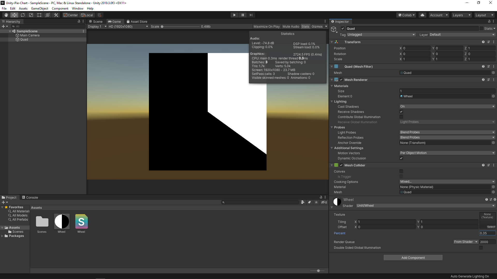

# Unity-Pie-Chart

I wanted to know how to divide a renctangle into two parts by applying two colours, white and black. [This shader code block](https://www.shadertoy.com/view/MtjBWy) was particularly useful for that purpose. For example, you could attach this shader to a plane, then the plane will have two domains separated from the centre as can be seen in the screenshot attached.
